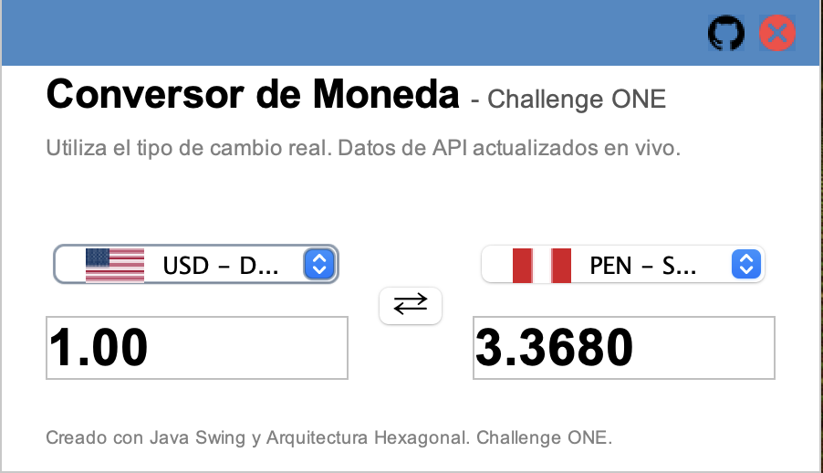
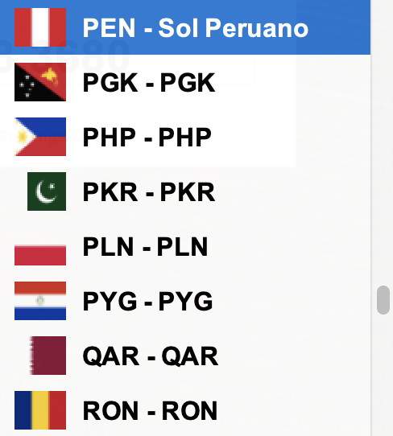

# Currency Converter — CurrencyConverter-Challenge-ONE



Aplicación de escritorio para convertir montos entre diferentes monedas usando tipos de cambio en tiempo real.

Flujo de uso (breve):

1. Al iniciar la aplicación aparece un splash (`SplashVentana`) con una barra de progreso.
2. Mientras el splash carga, la aplicación consulta en background la lista de monedas disponibles desde el adaptador de la API.
3. Al terminar el splash se muestra la ventana principal (`ConversorVista`) donde puedes:
	 - Elegir la moneda de origen y destino (los combos muestran código, nombre y una bandera).
	 - Escribir el monto a convertir (input con debounce para evitar llamadas excesivas).
	 - Usar el botón de intercambio (swap) para invertir monedas.
	 - Ver el resultado actualizado y mensajes de error en caso de problema con la API o con el formato del número.



Proyecto: conversor de divisas en Java con GUI (Swing) y arquitectura por capas / hexagonal.

## 🧭 Resumen rápido

Interfaz ligera para convertir entre monedas usando una API externa de tipos de cambio. Está pensado para ser fácil de entender y extender (separación clara entre UI, adaptadores y lógica de negocio).

Características principales:

- UI con Swing (ventana principal y splash).  
- Renderizado de monedas con banderas (carpeta `src/main/resources/flags`).
- Adaptador HTTP para consumir la API de Exchange Rates (`adapters/out/api/ExchangeRateApiAdapter`).
- Lógica de negocio en `domain/services` y puertos `domain/ports` (arquitectura hexagonal).  
- Empaquetado con Maven y Dockerfile multi-stage para crear una imagen ejecutable.

## Estructura del proyecto

El proyecto sigue una organización inspirada en arquitectura hexagonal (puertos y adaptadores):

- `domain/` contiene modelos, puertos (interfaces) y servicios (la lógica pura).  
- `adapters/in/` contiene implementaciones de entrada (UI) — en este caso Swing — que usan los puertos `in`.  
- `adapters/out/` contiene adaptadores hacia infra (HTTP hacia la API externa).  
- `Main` actúa como ensamblador, conectando adaptadores con servicios.

Beneficios: facilita probar la lógica sin UI, y reemplazar proveedores externos (por ejemplo, otra API) sin tocar la lógica.

Raíz relevante:

```
src/main/java/org/example
├─ Main.java       
├─ adapters
│  ├─ in
│  │  ├─ gui
│  │  │  ├─ ConversorVista.java  
│  │  │  ├─ SplashVentana.java   
│  │  │  └─ MonedaRenderer.java   
│  │  └─ utils
│  │     └─ MapeoBanderasUtil.java 
│  └─ out
│     └─ api
│        └─ ExchangeRateApiAdapter.java 
└─ domain
	 ├─ models
	 │  ├─ ConversionResult.java   
	 │  └─ ExchangeRatesResponse.java 
	 ├─ ports
	 │  └─ in
	 │     └─ ICurrencyConversionService.java
	 │  └─ out
	 │     └─ IExchangeRateProvider.java
	 └─ services
			└─ CurrencyConversionService.java 
```

Archivos importantes fuera de `src`:

- `pom.xml` — configuración de Maven (Java 23, dependencias: Gson, JUnit, Mockito).  
- `Dockerfile` — multi-stage: compila con Maven y prepara imagen final con JRE.

## Descripción de componentes clave

- `Main.java`: inicializa el splash y, en background, carga las monedas desde el adaptador de API y monta la vista `ConversorVista`.
- `ExchangeRateApiAdapter`: implementa `IExchangeRateProvider`. Lee la API key desde `/.properties` en recursos y consulta la API REST.
- `CurrencyConversionService`: encapsula la lógica de conversión (uso de rates y cálculos).
- `ConversorVista`: UI principal. Maneja debounce de inputs, swap entre monedas, y muestra errores en la interfaz.
- `MonedaRenderer` + `MapeoBanderasUtil`: muestran el código y nombre de la moneda junto con la bandera correspondiente tomada de `src/main/resources/flags`.

## Recursos gráficos

- `src/main/resources/flags/` — colección de muchas banderas en PNG (ej.: `us.png`, `es.png`, `pe.png`, ...). Se usan en el renderer.
- `src/main/resources/icons/` — iconos UI (`github.png`, `close.png`).
- `src/main/resources/cap/` — capturas de la aplicación incluidas en este repositorio:
	- `cap1.png` — captura de la aplicación (ventana principal).
	- `cap2.png` — captura mostrando la selección de banderas en el combo.

> Las imágenes se refieren con rutas relativas desde la raíz del repo (`src/main/resources/...`) para que se vean en GitHub y en el README.

## Configuración y API Key

Actualmente la aplicación busca la API_KEY en `src/main/resources/.properties` (clave presente en el repo para pruebas). Recomendación:

- No versionar claves reales. Mover el archivo fuera del control de versiones o usar variables de entorno.
- Para ejecutar localmente sin modificar el código, crea `src/main/resources/.properties` con el contenido:

```
API_KEY=TU_API_KEY_AQUI
```

O bien, sustituye la carga en `ExchangeRateApiAdapter` para leer la clave desde una variable de entorno o `config/` externo.

## Compilar y ejecutar (local)

Requisitos: JDK 23 y Maven 3.x

Compilar y empaquetar:

```bash
mvn clean package
```

Ejecutar JAR generado:

```bash
java -jar target/CurrencyConverter-Challenge-ONE-1.0-SNAPSHOT-jar-with-dependencies.jar
```

O ejecuta `Main` desde tu IDE preferido.

## Docker

El `Dockerfile` realiza un build multi-stage (compila con Maven y copia el JAR a una imagen con JRE). Pasos básicos:

Construir la imagen:

```bash
docker build -t currency-converter:1.0 .
```

Ejecutar el contenedor (modo básico):

```bash
docker run --rm -it currency-converter:1.0
```

Notas sobre GUI en contenedores:

- La aplicación es una GUI Swing; ejecutar en Docker requiere forward de la pantalla (X11/VNC). En macOS se necesita XQuartz o soluciones VNC. Para desarrollo es más simple ejecutar el JAR localmente.

## Tests

Ejecuta las pruebas unitarias con Maven:

```bash
mvn test
```

Hay tests de unidad para la capa de servicios (`src/test/java/.../CurrencyConversionServiceTest.java`).

## Seguridad y recomendaciones

- Mover la API key fuera del repo y documentar cómo inyectarla en `README` (puedo generar `config.example` si quieres).  
- Añadir manejo de retries/timeouts en `ExchangeRateApiAdapter` y tests para errores de red (mejoras futuras).

## Contribuir

1. Abre un issue describiendo la mejora o bug.  
2. Crea una rama `feature/...` o `fix/...` y envía un PR.  
3. Añade tests si cambias la lógica de negocio.

## Licencia

Indica aquí la licencia que quieras aplicar (por ejemplo MIT o Apache-2.0). Si deseas, puedo añadir `LICENSE` con MIT.

---

Si quieres, puedo hacer pasos adicionales ahora:

- Añadir un `config.example` y mover la clave real fuera del repo (actualizar `ExchangeRateApiAdapter` para documentar la carga de la clave).  
- Añadir instrucciones concretas para ejecutar la GUI dentro de Docker usando X11/VNC (macOS).  
- Añadir un pequeño test adicional que cubra error de red en el adaptador.


